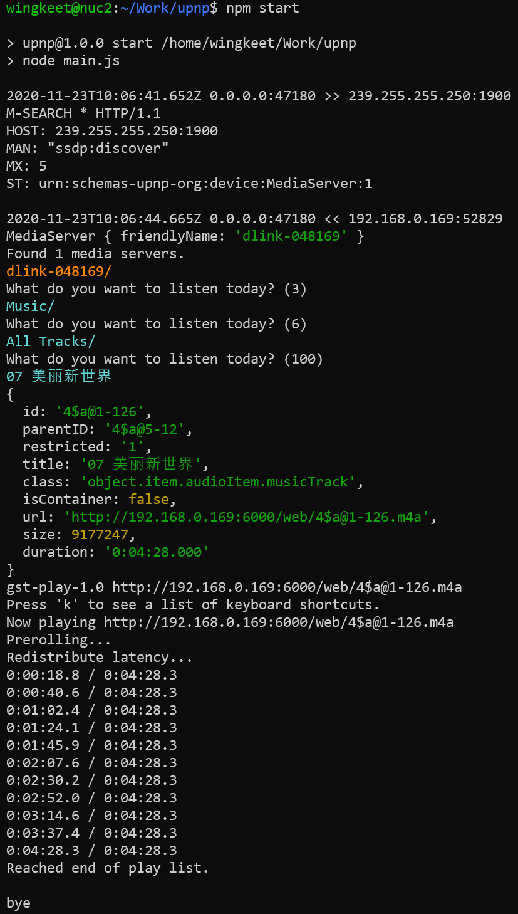

# upnp
Node.js program to discover and browse UPnP media servers.

### Introduction
`upnp` is a Node.js CLI program to demonstrate how to discover and browse UPnP media servers.

### Prerequisites
- Node.js >= 14.0.0 is required due to usage of the
[optional chaining operator (?.)](https://developer.mozilla.org/en-US/docs/Web/JavaScript/Reference/Operators/Optional_chaining) and
[nullish coalescing operator (??)](https://developer.mozilla.org/en-US/docs/Web/JavaScript/Reference/Operators/Nullish_coalescing_operator)
from ES2020.
- The file `upnp.js` has one external dependency, i.e., [xml2js](https://www.npmjs.com/package/xml2js).
- To play audio tracks, [GStreamer](https://gstreamer.freedesktop.org/) is used. GStreamer is included in all Linux distributions.

### Installation
```
$ cd ~
$ git clone https://github.com/wingkeet/upnp.git
$ cd upnp
$ npm install
```

### Usage
Type `npm start` to run the program. Below is a sample screenshot:



### Authors
* **Steve Leong** - *Initial work*

### License
This project is licensed under the [MIT License](https://opensource.org/licenses/MIT) -
see the [LICENSE](https://github.com/wingkeet/upnp/blob/master/LICENSE) file for details.
